```{r setup, include = FALSE}
library(knitr)
library(prmisc)
library(effsize)
library(tidyverse)

julis_theme <- theme(legend.position = "top", 
                     plot.title = element_text(size = 22, hjust = 0.5),
                     plot.subtitle = element_text(hjust = 0.5),
                     axis.title = element_text(size = 22),
                     axis.text = element_text(size = 18),
                     axis.line = element_line(colour = "black"),
                     legend.text = element_text(size = 20), 
                     legend.title = element_text(size = 20),
                     panel.background = element_blank(),
                     panel.grid = element_blank(),
                     strip.background = element_rect(fill = NA, size = 1),
                     strip.text = element_text(size = 20))

opts_chunk$set(echo = FALSE, message = FALSE, warning = FALSE, fig.align = 'center', out.width = '90%')
```

## Nice to meet(up) you!

\begin{columns}[onlytextwidth,T]
  \begin{column}{.4\linewidth}
    \includegraphics[width=\linewidth]{./pics/juli.jpg}
  \end{column}
  \begin{column}{.6\linewidth}
  \vspace{1.5cm}
  
  \begin{itemize}
    \item Juli Tkotz
    \item PhD student ZI Mannheim
    \item RG Psychology and Neurobiology of Sleep and Memory
  \end{itemize}

  \end{column}
\end{columns}

## What is a reproducible manuscript?

- A manuscript that directly embeds your **research data** and **analysis code**.
- Any person with the raw data can run the code and **reproduce** your manuscript.
- Interactive stand-alone versions are possible.

## Why do we need it?

```{r lakens}
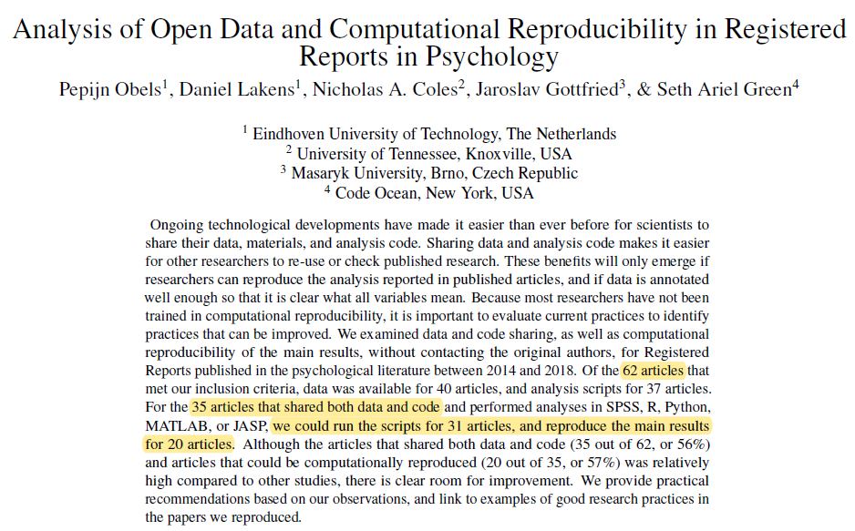
```

\tiny
@obels_2019
\normalsize

## Beyond reproducible analyses

```{r copy_paste_hell}
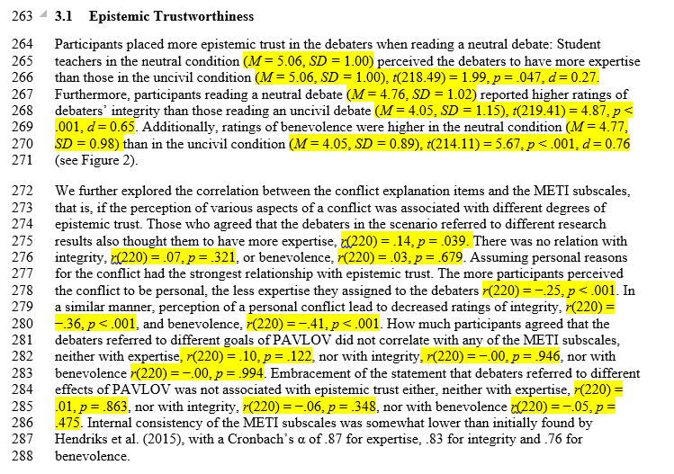
```

## R Markdown to the rescue

```{r intext_stats}
nerd <- read.csv("./data/nerd.csv", sep = "\t")
```

```{r slide_inception}
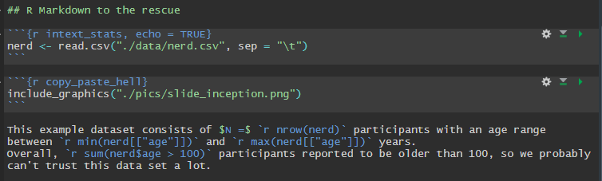
```

This example dataset consists of $N =$ `r nrow(nerd)` participants with an age range between `r min(nerd[["age"]])` and `r max(nerd[["age"]])` years.
Overall, `r sum(nerd$age > 100)` participants reported to be older than 100, so we probably can't trust this data set a lot.

\tiny
Data retrieved from https://openpsychometrics.org/
\normalsize

## R Markdown to the rescue

```{r slide_inception_bold}

```

This example dataset consists of **$N =$ `r nrow(nerd)`** participants with an age range between **`r min(nerd[["age"]])`** and **`r max(nerd[["age"]])`** years.
Overall, **`r sum(nerd$age > 100)`** participants reported to be older than 100, so we probably can't trust this data set a lot.

## Detecting errors

```{r woops}
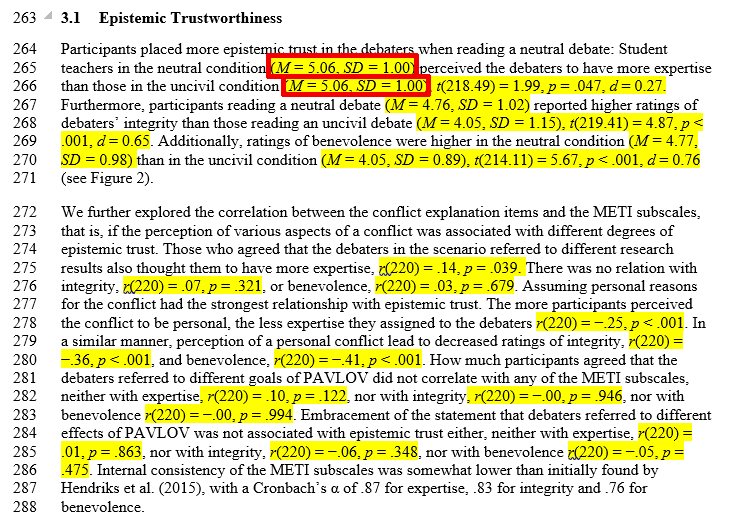
```

Wait a minute ...

## Detecting errors

```{r found_it}
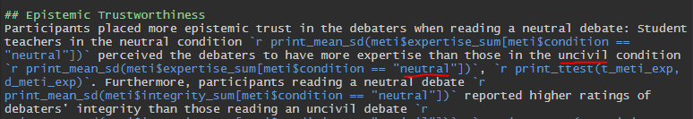
```

There it is!

## How about some stats?

```{r t_test_prep}
nerd[["sum_score"]] <- rowSums(nerd[paste0("Q", 1:26)])
nerd <- nerd[nerd[["gender"]] %in% 1:2, ]
nerd[["gender"]] <- factor(nerd[["gender"]], levels = 1:2, labels = c("male", "female"))
```

\footnotesize

```{r t_test, echo = TRUE}
nerd_ttest <- t.test(sum_score ~ gender, data = nerd)
nerd_effsize <- cohen.d(sum_score ~ gender, data = nerd)
```

\normalsize

```{r t_test_screenshot, out.width = '100%'}
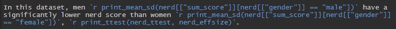
```

In this dataset, men `r print_mean_sd(nerd[["sum_score"]][nerd[["gender"]] == "male"])` have a significantly lower nerd score than women `r print_mean_sd(nerd[["sum_score"]][nerd[["gender"]] == "female"])`, `r print_ttest(nerd_ttest, nerd_effsize)`.

## Yeah, plots!

```{r density_plot}
nerd %>% 
  ggplot(aes(x = sum_score, fill = gender)) +
  geom_density(alpha = .5, position = "identity", size = 1) +
  scale_fill_manual(values = c("#eb811b", "#23373b")) +
  scale_x_continuous(breaks = seq(0, 140, 35),
                     limits = c(0, 140)) +
  labs(x = "nerdy sum score") +
  julis_theme
```

## Yeah, references!

```{r citation}
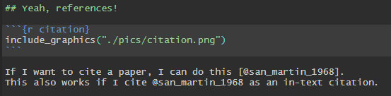
```

If I want to cite a paper, I can do this [@san_martin_1968].
This also works if I cite @san_martin_1968 as an in-text citation.

## How to get bibtex references

```{r get_bibtex}
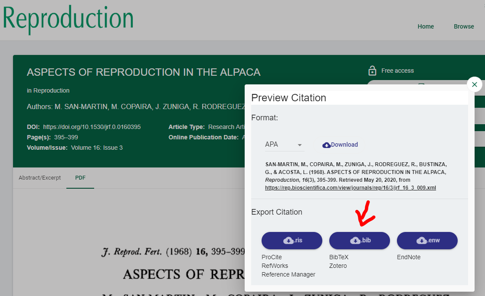
```

## Fully formatted articles

The `R`-package `papaja` offers you documents that are formatted according to APA (6) style.

\tiny
https://github.com/crsh/papaja
\normalsize

```{r papaja}
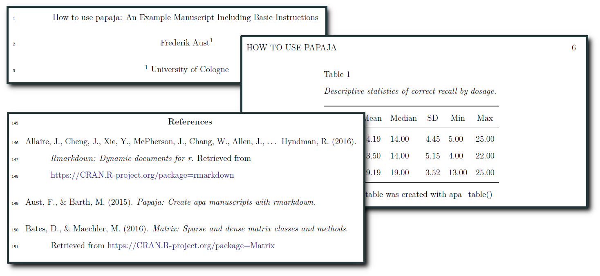
```

## Or a whole book?

```{r bookdown}
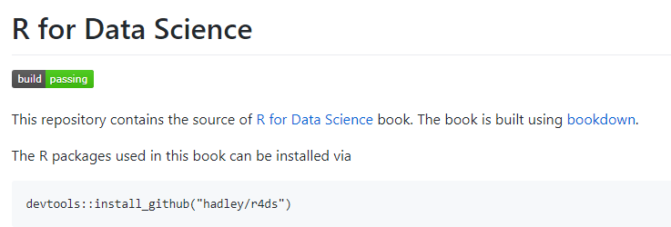
```

```{r bookdown2}
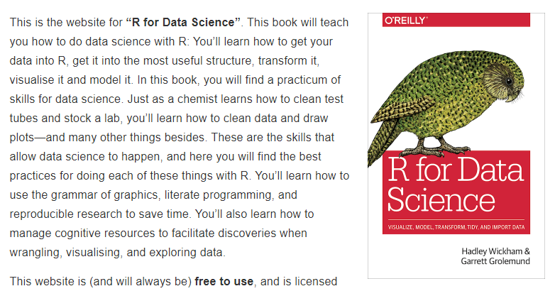
```

## Talking about reproducibility ...

```{r missing_package}
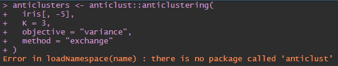
```

## Code capsules

```{r code_ocean, out.width = '100%'}
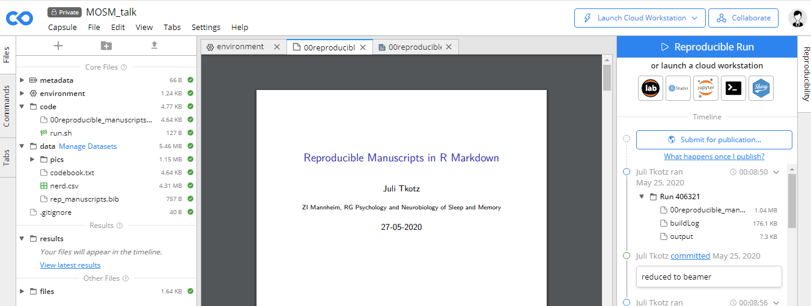
```

\small
[CodeOcean](https://codeocean.com/)
\normalsize

## Code capsules

```{r binder, out.width = '100%'}
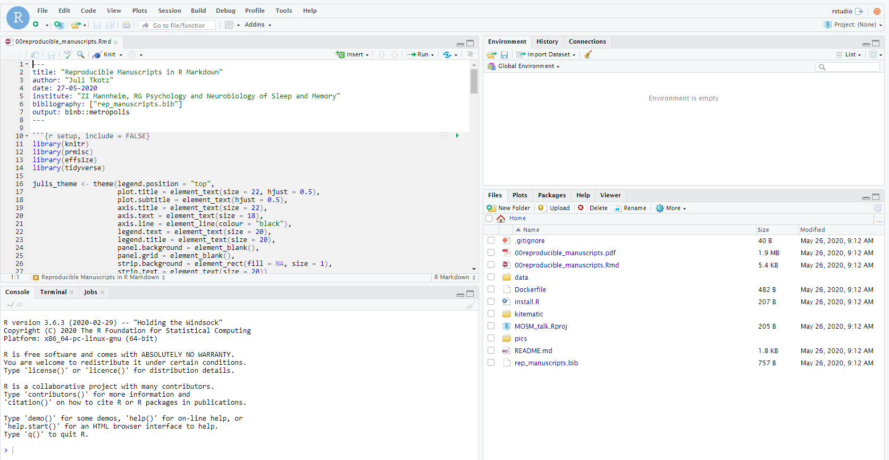
```

\small
[Binder](https://github.com/rocker-org/binder)
\normalsize

## There will be pain

```{r pain, out.width = '100%'}
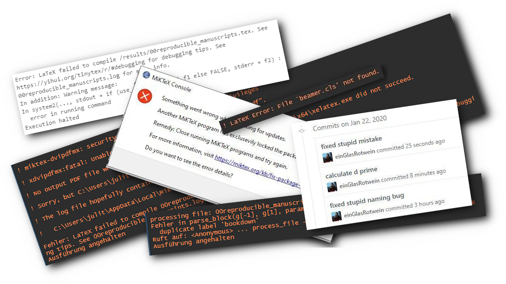
```

## But it's worth it

- Saves time for others and for future you.
- Mistakes are easier to spot and easier to correct.
- Your data and your manuscript will survive longer.
- Others can learn from your analyses.

## Thank you!

Find this presentation on [GitHub](https://github.com/einGlasRotwein/MOSM_talk).

```{r find_binder, out.width = '40%'}
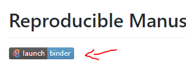
```

And definitely check the binder button! Thank you, Philipp Zumstein!

Or on [CodeOcean](https://doi.org/10.24433/CO.3923848.v2).

Or on the [OSF](https://osf.io/gzf9h/).

## Useful Ressources

- [Tutorial for a reproducible workflow](https://psyarxiv.com/8xzqy/) with R Markdown, Git, Make and Docker by @peikert_brandmaier_2019
- [Example capsule](https://t.co/icY9wPvJgI?amp=1) for papaja on CodeOcean (also see the [papaja manual](https://crsh.github.io/papaja_man/) and give [Frederik Aust](https://twitter.com/FrederikAust) a cookie)
- The computational reproducibility part (week 5) of Daniel Laken's coursera course ["Improving Statistical Questions"](https://www.coursera.org/learn/improving-statistical-questions)
- R Markdown - [The Definitive Guide](https://bookdown.org/yihui/rmarkdown/) by Yihui Xie, J. J. Allaire and Garrett Grolemund

## Questions

- Collaborative writing?
- Journals?
- Why not only code?

## Collaborative writing

Here is an example of how I am editing this slide.
I made a typo hero.
In the commit history, you can see how I fixed it.

## References
\setlength{\parindent}{-0.2in}
\setlength{\leftskip}{0.2in}
\setlength{\parskip}{8pt}
\noindent
\small
